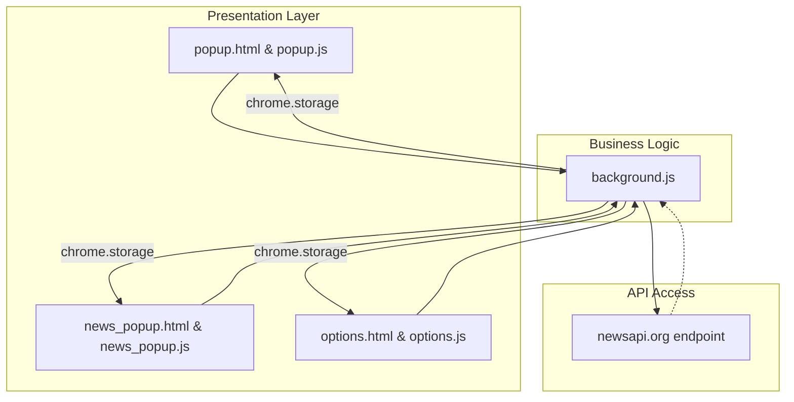
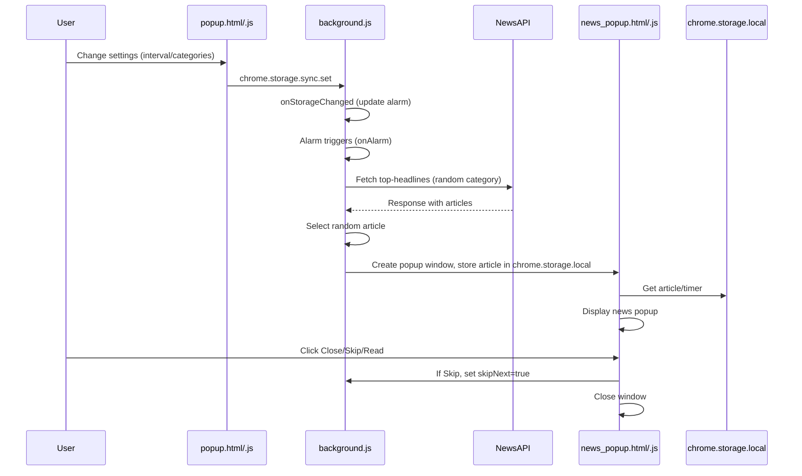
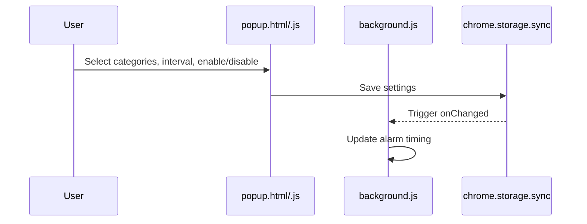

# Fantastic Daily News Feature Documentation

## Overview

Fantastic Daily News is a Chrome extension that delivers breaking news using visually engaging popup notifications. Users can personalize the extension by selecting their preferred news categories and notification intervals. The extension fetches news from the [NewsAPI](https://newsapi.org) and displays a random article in a stylized popup, offering controls to skip, close, or read the full article.

The extension empowers users to stay updated without interrupting their workflow. All preferences, including categories, update frequency, and enable status, are stored in Chrome's synchronized storage, ensuring settings persist across devices. The extension offers both quick-access popup settings and a full options page for deeper customization.

---

## Architecture Overview



---

## Component Structure

### 1. Presentation Layer

#### **Popup Settings UI** (`popup.html` + `popup.js`)
- **Purpose**: Allows users to enable/disable notifications, set interval, and choose news categories via a quick-access popup.
- **Key Elements**:
  - Toggle for activation status with live indicator.
  - Dropdown for news interval (including test, frequent, or daily).
  - Selectable category "pills" for interest selection.
  - Save button with confirmation message.
  - Footer credit with GitHub link.

#### **News Popup UI** (`news_popup.html` + `news_popup.js`)
- **Purpose**: Displays a single news article in a popup with image, headline, description, timer/progress bar, and action buttons.
- **Key Elements**:
  - News image with overlay.
  - Source badge.
  - Headline, description, and metadata.
  - Countdown timer (text and progress bar).
  - Buttons: "Read Full Story", "Skip Next", "Close".
  - Loader/spinner during content preparation.

#### **Options Page UI** (`options.html` + `options.js`)
- **Purpose**: Dedicated settings page (chrome://extensions) for adjusting notification preferences.
- **Key Elements**:
  - Toggle for enabling news popups.
  - Interval select dropdown.
  - Category selection grid.
  - Save button with status indicator.

---

### 2. Business Layer

#### **Background Logic** (`background.js`)
- **Purpose**: Central orchestrator for scheduling, fetching, and displaying news popups based on user settings.
- **Key Responsibilities**:
  - Initialization on install/startup.
  - Interval management using Chrome alarms.
  - Fetching random news articles from API.
  - Coordinating popup window creation and auto-close logic.
  - Handling skip-next logic.
  - Synchronizing data using Chrome storage APIs.

| Method/Handler | Description | Returns |
|---------------|-------------|---------|
| `onInstalled` | Sets up default settings on first install. | void |
| `onStartup` | Checks "once a day" setting and triggers popup if needed. | void |
| `setupAlarm(interval)` | Configures/removes alarm based on interval. | void |
| `checkOnceADayNews()` | Ensures only one popup per day if set. | void |
| `checkAndShowNews()` | Fetches article and opens news popup if conditions met. | void |
| `onAlarm` | Alarm trigger to display news. | void |
| `onStorageChanged` | Updates alarm if interval changes. | void |
| `onWindowRemoved` | Resets state when popup closes. | void |

---

### 3. Data Access Layer

#### **NewsAPI Access**
- **Host Permission**: `https://newsapi.org/*`
- **Endpoint Used**: `/v2/top-headlines`
- **Query Parameters**:
  - `category`: one of ["business", "entertainment", "general", "health", "science", "sports", "technology"]
  - `language`: "en"
  - `pageSize`: 20
  - `apiKey`: stored in code (extension only)
- **Response**: JSON with `articles` array.

**API Endpoint in Use:**

### Fetch Top Headlines Endpoint (GET)

```api
{
    "title": "Fetch Top Headlines",
    "description": "Fetches top headlines for a random user-selected category in English.",
    "method": "GET",
    "baseUrl": "https://newsapi.org",
    "endpoint": "/v2/top-headlines",
    "headers": [],
    "queryParams": [
        { "key": "category", "value": "The selected news category", "required": true },
        { "key": "language", "value": "en", "required": true },
        { "key": "pageSize", "value": "20", "required": false },
        { "key": "apiKey", "value": "Your NewsAPI key", "required": true }
    ],
    "pathParams": [],
    "bodyType": "none",
    "requestBody": "",
    "responses": {
        "200": {
            "description": "Success",
            "body": "{\n  \"status\": \"ok\",\n  \"totalResults\": 20,\n  \"articles\": [\n    {\n      \"source\": { \"id\": \"cnn\", \"name\": \"CNN\" },\n      \"author\": \"Author Name\",\n      \"title\": \"Headline Text\",\n      \"description\": \"Article description.\",\n      \"url\": \"https://example.com/article-url\",\n      \"urlToImage\": \"https://example.com/image.jpg\",\n      \"publishedAt\": \"2024-06-07T12:00:00Z\",\n      \"content\": \"Full Content\"\n    }, ...\n  ]\n}"
        },
        "401": {
            "description": "Unauthorized (invalid API key)",
            "body": "{ \"status\": \"error\", \"code\": \"apiKeyInvalid\", \"message\": \"Your API key is invalid.\" }"
        }
    }
}
```

---

## Feature Flows

### 1. News Popup Scheduling and Display



---

### 2. Settings Update Flow



---

## State Management

**States Handled:**
- **Enabled/Disabled**: Controlled by `isEnabled` in storage, reflected in popup and options UI.
- **Interval**: Customizable, supports test and "once-a-day" modes.
- **Categories**: Multiple selections stored and used for random category picking.
- **Current News**: Stored in `chrome.storage.local` for popup rendering.
- **Skip Next**: If user skips, suppresses next scheduled popup.

---

## Data Models

### News Article Model

| Property      | Type     | Description                                  |
|---------------|----------|----------------------------------------------|
| source        | object   | { id: string/null, name: string }            |
| author        | string   | Article author                               |
| title         | string   | Article headline                             |
| description   | string   | Short description/summary                    |
| url           | string   | Link to full article                         |
| urlToImage    | string   | Image URL for news                           |
| publishedAt   | string   | ISO 8601 date/time                           |
| content       | string   | Full content (may be truncated)              |

---

## UI States

- **Loading**: Spinner shown while news is loading in the popup.
- **Loaded**: News content shown with timer and controls.
- **No News Available**: Shows placeholder if no article is found.
- **Settings Updated**: Confirmation ("Settings Updated!" or "✓ Settings Saved!") after saving preferences.

---

## Integration Points

- **Chrome Extension APIs**:
  - `chrome.storage.sync` for persisting user settings.
  - `chrome.storage.local` for temporary news data.
  - `chrome.alarms` for background scheduling.
  - `chrome.windows` for popup management.
  - `chrome.system.display` for multi-monitor support and popup placement.
- **Third-Party**:
  - [NewsAPI.org](https://newsapi.org) for fetching news headlines.

---

## Error Handling

- **API Fetch Errors**: Caught and logged; no popup displayed if fetch fails.
- **Image Loading Failures**: Hides image section if image fails to load.
- **Settings Validation**: Prevents saving if no categories are selected; alerts user.

---

## Caching Strategy

- **chrome.storage.sync**: Stores persistent user preferences (categories, interval, enabled).
- **chrome.storage.local**: Stores the current news article and timer for popup display.
- **lastStartupRun**: Used to ensure "once-a-day" notifications only trigger once per day.

---

## Dependencies

- **NewsAPI.org**: External news data provider.
- **Chrome Extension APIs**: For storage, alarms, notifications, display info, and window management.

---

## Key Classes Reference

| Class/Script           | Location             | Responsibility                                  |
|------------------------|---------------------|-------------------------------------------------|
| `background.js`        | root                | Scheduling, fetching news, popup orchestration  |
| `popup.html`/`popup.js`| root                | User settings popup (quick access)              |
| `news_popup.html`/`news_popup.js` | root  | News popup UI and controls                      |
| `options.html`/`options.js`| root            | Full options/settings page                      |

---

## User Actions & Analytics

- **Screen Views**: No explicit analytics, but user actions are tracked by storage updates and popup triggers.
- **User Actions**:
  - Enable/disable extension.
  - Change interval.
  - Select/deselect categories.
  - Click "Save"/"Update Preferences".
  - Skip or close a news popup.
  - Click "Read Full Story" (opens in new tab).

---

## File-by-File Documentation

---

### manifest.json

Defines the Chrome extension's metadata, permissions, and entry points.

| Key               | Description                                              |
|-------------------|---------------------------------------------------------|
| manifest_version  | Extension manifest version ("3")                        |
| name              | Name shown in Chrome                                    |
| version           | Extension version                                       |
| description       | Short summary                                           |
| permissions       | ["storage", "alarms", "notifications", "system.display"]|
| host_permissions  | ["https://newsapi.org/*"]                               |
| action            | Default popup and title                                 |
| background        | Registers `background.js` service worker                |
| icons             | Extension icons for various sizes                       |

---

### background.js

Implements all background logic: initialization, scheduling, API fetching, and popup creation.

**Key Functionalities:**
- Initializes default settings if not present.
- Sets up alarms and handles interval changes.
- Manages "once-a-day" mode.
- Fetches news articles from NewsAPI and displays a popup.
- Controls popup window lifecycle and position based on display info.
- Handles auto-closing of news window and skip logic.
- Listens to window removal to reset state.

---

### news_popup.html & news_popup.js

**news_popup.html**:
- Provides a stylized popup to display a random news article.
- Includes image, source badge, headline, description, a countdown timer, and action buttons.
- Responsive glassmorphic design and animated progress bar.

**news_popup.js**:
- Populates the UI with the article fetched from `chrome.storage.local`.
- Handles loader display and fallback if no image is provided.
- Controls the countdown timer/progress bar for auto-close.
- Handles "Skip Next" and "Close" button events.

---

### popup.html & popup.js

**popup.html**:
- Popup for quick settings adjustment.
- Contains toggles, dropdowns, pill-based categories, and visual feedback.

**popup.js**:
- Renders category pills dynamically.
- Loads and saves user preferences to `chrome.storage.sync`.
- Validates category selection before saving.
- Updates the status indicator and confirmation message after save.
- Opens GitHub link in a new tab using Chrome API.

---

### options.html & options.js

**options.html**:
- Full extension options page (for chrome://extensions or settings).
- Modern card-based layout for category, interval, and enable toggle.
- Responsive and accessible.

**options.js**:
- Dynamically generates category buttons.
- Loads settings from Chrome storage.
- Allows saving changes, with feedback.
- Ensures at least one category is always selected.

---

```card
{
    "title": "Skip Next News Feature",
    "content": "Clicking 'Skip Next' in the popup suppresses the next scheduled news notification, preventing interruption for one cycle."
}
```

---

## Testing Considerations

- **Settings Persistence**: Changing settings in popup/options should persist and affect background logic.
- **Popup Timing**: Popup should appear at correct intervals and auto-close as expected.
- **"Once a Day" Mode**: Only one popup per day on browser startup.
- **Skip Logic**: "Skip Next" button should suppress only the next scheduled popup.
- **Image Handling**: Popup hides image if invalid or missing.
- **Cross-Device Sync**: Settings should sync via Chrome account.
- **Failure Scenarios**: Test API downtime, invalid API key, and storage failures.

---
